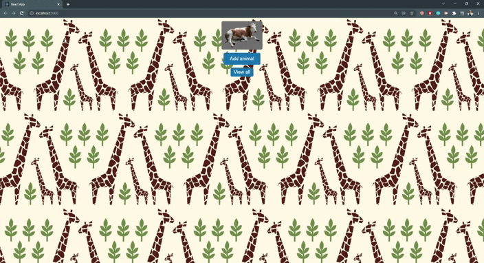

# Animals list app

If you want to test it yourself <a href="https://admiring-hawking-efdf90.netlify.app/" target="_blank">Click here</a>

This is very simple animals list app, created in React.js framework. 

## Available Scripts

In the project directory, you can run:

### `npm start`

Runs the app in the development mode.\
Open [http://localhost:3000](http://localhost:3000) to view it in the browser.

### `npm test`

Launches the test runner in the interactive watch mode.\
See the section about [running tests](https://facebook.github.io/create-react-app/docs/running-tests) for more information.

### `npm run build`

Builds the app for production to the `build` folder.\
It correctly bundles React in production mode and optimizes the build for the best performance.

See the section about [deployment](https://facebook.github.io/create-react-app/docs/deployment) for more information.

 

Hope you enjoy,
Toms 
